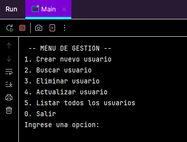
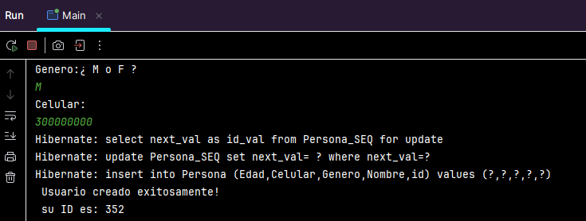
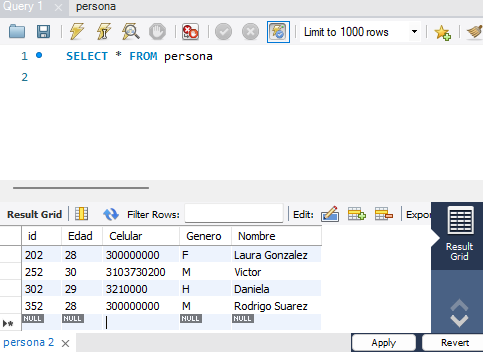

# CRUD
Este proyecto es una aplicación CRUD (Crear, Leer, Actualizar, Eliminar) desarrollada en Java utilizando JPA, Maven y conectada a una base de datos MySQL. Su propósito es gestionar registros de personas a través de una interfaz de consola. Fue construido como práctica de programación orientada a objetos y persistencia con Java, en el contexto de mis estudios en Ingeniería de Software.

**Tecnologias utilizadas**
- Java 17
- Maven
- Jakarta Persistence API (JPA)
- MySQL Workbench + MySQL Server
- IntelliJ IDEA
- Git
  
**Funcionalidades**
- Crear persona
- Buscar persona por ID o nombre
- Listar todas las personas
- Actualizar datos (nombre, edad, género, celular)
- Eliminar persona
- Persistencia en base de datos (utilizando JPA y MySQL)

**Cómo ejecutar el proyecto**

Clona el repositorio:
git clone https://github.com/Canorjuela/CRUD.git

Debes tener:
- Java instalado
- MySQL corriendo 
- IntelliJ con Maven configurado
- Configura la base de datos crud en MySQL (se creará automáticamente al ejecutar).
- Ejecuta la clase Main.java.

Considero que el proyecto tiene posibles mejoras futuras, entre ellas:
- Migrar a Spring Boot
- Añadir pruebas unitarias (JUnit)
- Crear una interfaz gráfica o API REST
- Validaciones de entrada más robustas
- Autenticación básica

**Capturas de Pantalla**

Menu principal

Usuario Creado

BD

Camila Orjuela
Estudiante de Ingeniería de Software | Desarrolladora Backend en formación
GitHub

